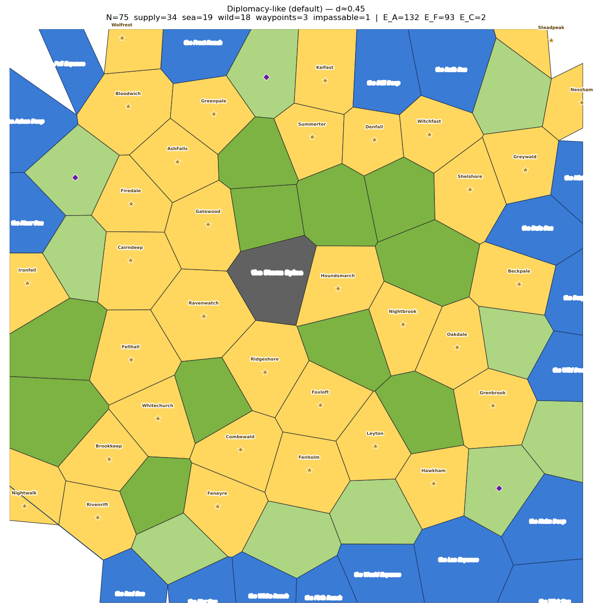
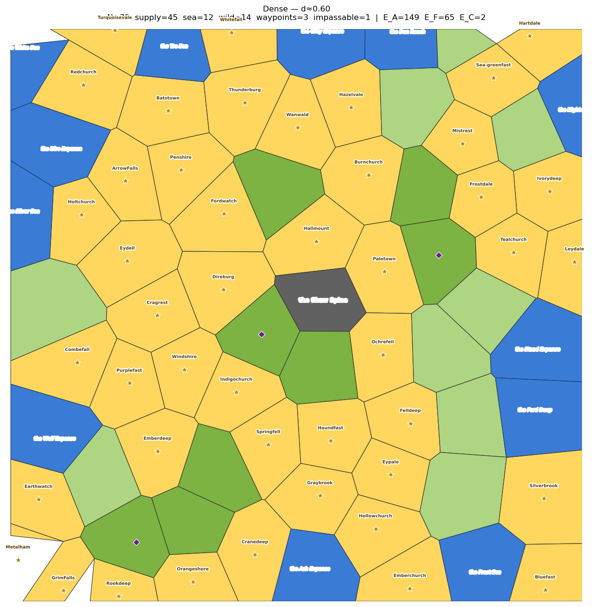
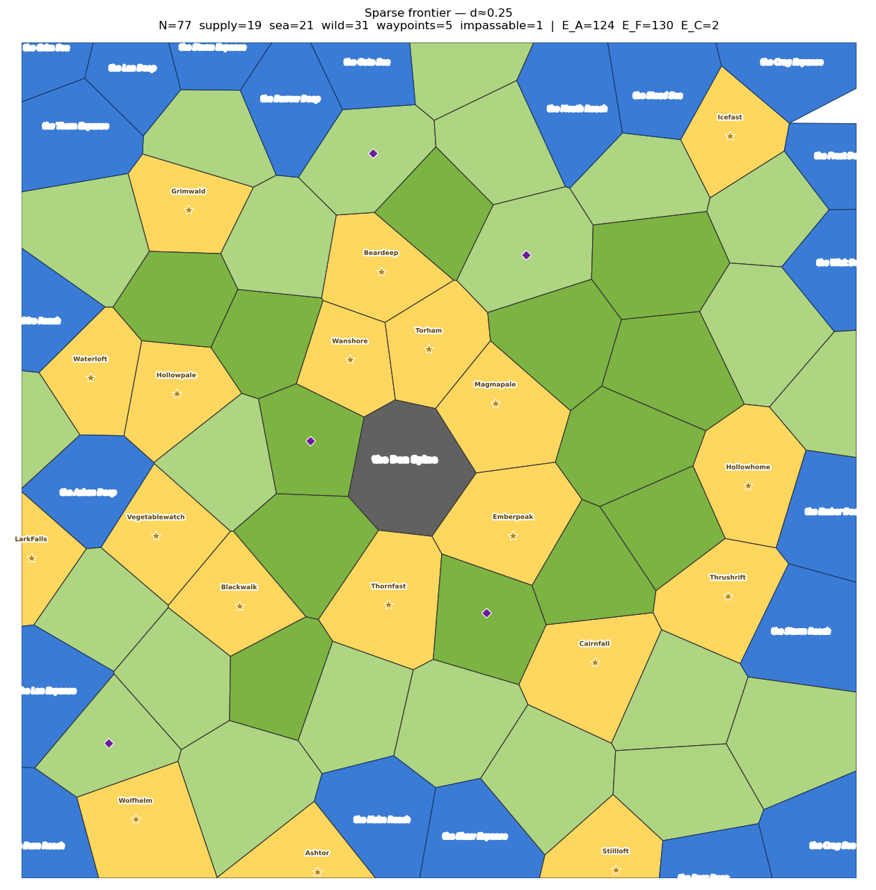

# Schelling Campaign Map

Turn a board game image into a Voronoi point-crawl campaign map, **starting from the board's salient Schelling points** — the locations every player would naturally coordinate on.

No random seeds. No Poisson-disc filler. The board tells you where the regions go.

## The idea

Thomas Schelling observed that people coordinate on salient points without communicating. Board games are full of them: the castle everyone recognizes, the hazard square everyone remembers, the named location on the card. This skill turns those points into a campaign map:

1. **Survey** the board for Schelling points (figures → capitals, named locations → supply centers, special spaces → waypoints, distinct geography → wilds/waters)
2. **Emit** them as structured data (name, kind, normalized coordinates, provenance)
3. **Seed** a Voronoi tessellation directly on the measured positions — no snapping, no guessing
4. **Render** the point-crawl with every marker exactly on its seed

## What's here

```
schelling-campaign-map/
├── SKILL.md              # The method: survey → emit → seed → Voronoi → render
├── bin/
│   ├── survey.py         # Crop/overlay helpers for the manual measure-and-verify loop
│   └── survey_auto.py    # Headless detect + verify (HSV color check, exits non-zero on failure)
├── references/
│   ├── method.md         # Detailed survey method
│   ├── headless.md       # Programmatic verification for unsupervised harnesses
│   └── lessons.md        # Hard-won lessons (measure directly, sweep for misses, …)
└── examples/
    └── candy-land/       # Reference implementation: 26 regions, 9 verified waypoints
```

## Headless verification

```bash
python3 bin/survey_auto.py verify --board board.jpg && python3 pipeline.py
```

A seed is correct iff the board underneath it is the right color. The script samples a window around each seed and fails loudly if the expected square color isn't there. Never render on a failed verify.

## Examples

**Candy Land** (26 regions): 6 faction capitals at the character figures, 5 more supply centers at named locations, 6 wilds/waters, 9 waypoint seeds on the special squares (3 licorice "lose a turn" + 6 picture spaces) — all measured directly off the board, all verified.

**Downtown San Francisco** (16 regions): 13 landmark supply centers + 3 Bay water regions on a tourist map.

## Sample maps at each strategic density

Generated by `examples/densities/generate.py`: Poisson-disc seeds (Bridson, N≈75), edge-aware kind assignment, Voronoi tessellation, typed multiplex graph via `bin/graph_model.py` (E_A/E_F derived, coasts split, 2 sample E_C portals). Place names are manifested from the [dunmanifestin fantasy palettes](https://github.com/gavmor/dunmanifestin-palettes) via `examples/densities/dunmanifestin.py` (a small Python port of the palette engine), curated to the compound templates. Gold = supply center, blue = sea, green = wild, purple diamond = neutral waypoint, gray = impassable (the Switzerland).

### Diplomacy-like (default, d≈0.45)

~45% supply, ~25% sea, ~28% wild, ~1% impassable — the 19/55/34 template. Standard great-power friction.



### Dense (d≈0.60)

High quest density; every region matters.



### Sparse frontier (d≈0.25)

A few key locations in vast wilds; exploration over politics.



## Invariants

- Seeds are hand-placed at the board's canonical markers. Random/filler seeding is rejected.
- Special-space seeds use measured square centers with no path-snapping.
- Waypoints are neutral and unclaimable.
- Every rendered marker sits on its seed. Every name was read off the board.

## License

MIT
